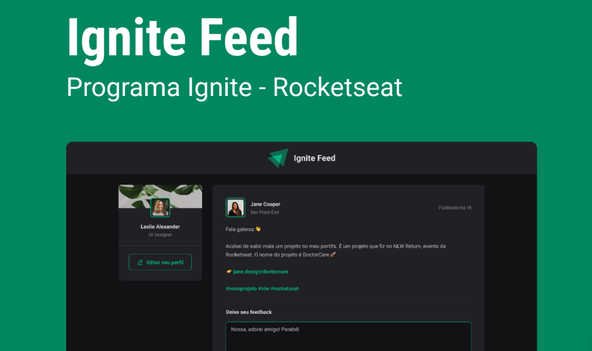

# Ignite | Desafio da Rocketseat

#### Uma mini aplicação de rede social para compartilhar comentários e aplaudir publicações, construída em JavaScript.

## Descrição

Neste projeto, desenvolvido como parte de um desafio do programa Ignite da Rocketseat, os usuários podem adicionar comentários com o nome do autor e uma descrição de cargo. Outros usuários podem ver o nome e o cargo de quem publicou a tarefa, promovendo uma interação social básica.

## Funcionalidades

- **Adicionar comentários**: Crie comentários com informações de autor e cargo.
- **Visualização de publicações**: Veja o nome e cargo de quem publicou cada tarefa.
- **Aplaudir**: Similar ao botão de "curtir".
  
## Tecnologias Utilizadas

- React
- CSS
- JavaScript

## Como Executar

Instale as dependências do package.json e rode o comando:

```bash
npm run dev
```
## 📄 Licença

- MIT License
- Este projeto é de uso livre e pode ser modificado ou integrado em outros projetos.